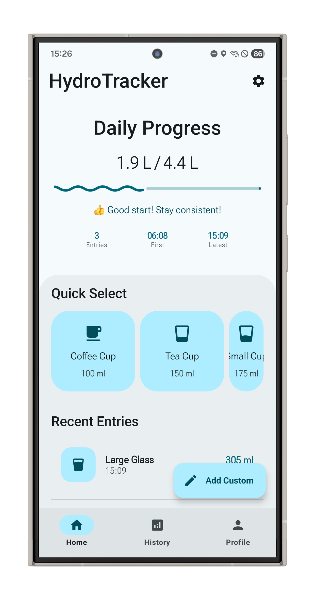
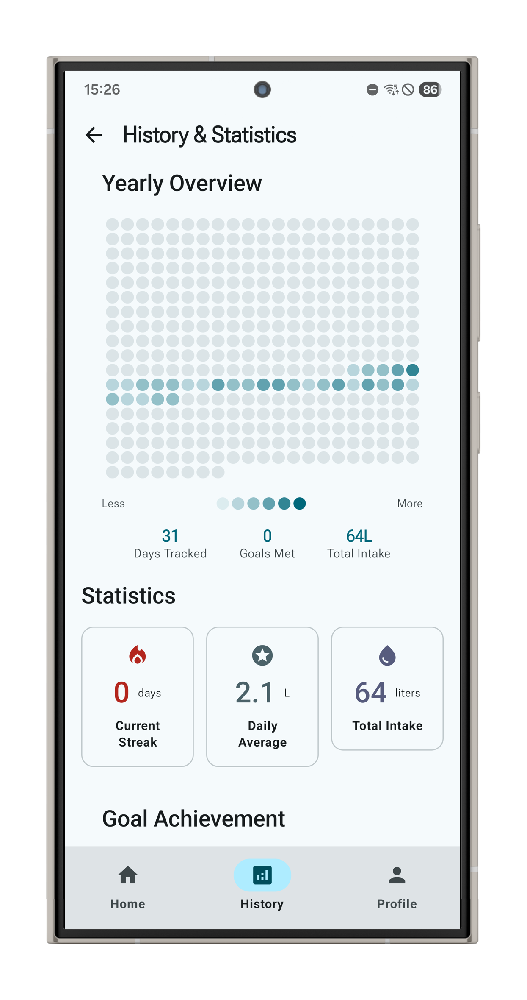

# 🌊 HydroTracker

<p align="center">
  
</p>

<p align="center">
  <strong>A modern, intelligent water intake tracking application</strong><br>
  Built with Android Jetpack Compose and Material 3 Design
</p>

<p align="center">
  <a href="#features">Features</a> •
  <a href="#screenshots">Screenshots</a> •
  <a href="#installation">Installation</a> •
  <a href="#contributing">Contributing</a> •
  <a href="#license">License</a>
</p>

<p align="center">
  
  
  
  
</p>

---

## ✨ Features

### 🎯 Core Functionality
- **📊 Daily Water Tracking** - Log intake with pre-defined containers or custom amounts
- **📈 Progress Visualization** - Real-time tracking with animated Material 3 wavy progress indicators
- **🎯 Smart Goal Setting** - Personalized daily hydration goals based on user profile
- **📋 Comprehensive Analytics** - Daily and historical statistics with trend analysis

### 🎨 User Experience
- **🎨 Material 3 Design** - Latest Material Design with Expressive APIs and dynamic theming
- **👋 Guided Onboarding** - Multi-step personalized setup flow
- **⚡ Quick Actions** - Container presets for instant logging
- **📚 Rich History** - Detailed intake history with patterns and insights

### 🤖 Smart Features
- **🔔 Intelligent Notifications** - Context-aware reminders that respect sleep schedules
- **📱 Home Screen Widgets** - Multiple widget sizes with real-time progress updates
- **🏃 Activity-Based Goals** - Recommendations based on activity level and personal metrics
- **💾 Robust Data Persistence** - SQLite database with automatic backups

### ♿ Accessibility & Customization
- **🌙 Theme Customization** - Dynamic colors, dark mode, and accessibility features
- **⏰ Flexible Scheduling** - Customizable reminder intervals and active hours
- **👤 Profile Management** - Comprehensive user settings and preferences

---

## 📱 Screenshots

<p align="center">
  
  
  
  
</p>

### Main Features
| Home Screen | Water Logging | Analytics Dashboard | Settings |
|-------------|---------------|-------------------|----------|
|  |  |  |  |

### Themes & Widgets
| Dark Mode | Widget Preview | Notification |
|-----------|----------------|--------------|
|  |  |  |

---

## 🛠️ Technical Stack

### Built With
- **🚀 Kotlin** - Modern, safe programming language
- **🎨 Jetpack Compose** - Modern UI toolkit with Material 3 Expressive APIs
- **💾 Room Database** - SQLite abstraction with reactive queries
- **🧭 Navigation Compose** - Type-safe navigation with smooth transitions
- **🎨 Material 3** - Latest Material Design components and theming
- **⚡ Coroutines & Flow** - Asynchronous programming and reactive streams

### Architecture
- **🏗️ MVVM** - Model-View-ViewModel architecture pattern
- **📦 Repository Pattern** - Clean separation of data layer
- **🏃 Single Activity** - Modern Android navigation architecture
- **🎨 Compose-First** - Built entirely with Jetpack Compose

### Key Dependencies
```kotlin
// Core Compose & Material 3
implementation("androidx.compose.material3:material3:1.4.0-alpha18")
implementation(platform("androidx.compose:compose-bom:2025.07.00"))

// Database
implementation("androidx.room:room-runtime:2.7.2")
implementation("androidx.room:room-ktx:2.7.2")

// Navigation
implementation("androidx.navigation:navigation-compose:2.9.3")
```

---

## 📦 Installation

### Prerequisites
- **Android Studio** - Koala Feature Drop | 2024.1.2 or later
- **Android SDK** - API 34+ (Target SDK 36)
- **Kotlin** - 2.0.21+
- **Gradle** - 8.12.0+

### Build Steps

1. **Clone the repository**
   ```bash
   git clone https://github.com/cemcakmak/HydroTracker.git
   cd HydroTracker
   ```

2. **Open in Android Studio**
   - Launch Android Studio
   - Select "Open an Existing Project"
   - Navigate to the cloned directory

3. **Build the project**
   ```bash
   ./gradlew assembleDebug
   ```

4. **Install on device**
   ```bash
   ./gradlew installDebug
   ```

### Alternative: Direct APK
Download the latest APK from [Releases](https://github.com/cemcakmak/HydroTracker/releases)

---

## 🚀 Getting Started

### 1. Initial Setup


Complete the guided onboarding:
- **👤 Profile Setup** - Age, gender, activity level
- **🎯 Goal Calculation** - Automatic daily hydration target
- **⏰ Notification Setup** - Reminder preferences and timing
- **🥤 Container Presets** - Choose your favorite containers

### 2. Grant Permissions
Required permissions for optimal experience:
- **🔔 POST_NOTIFICATIONS** (Android 13+) - For hydration reminders
- **⏰ SCHEDULE_EXACT_ALARM** - For precise reminder timing
- **📸 CAMERA** (Optional) - For profile photo capture

### 3. Start Tracking
Begin your hydration journey:
- **⚡ Quick Add** - Tap container presets for instant logging
- **➕ Custom Amounts** - Use FAB for specific volumes
- **📊 Monitor Progress** - View real-time animated progress
- **📈 Review History** - Access detailed analytics

---

## 🎮 Usage Guide

### Daily Tracking
- **Quick Add**: Tap pre-configured container buttons
- **Custom Entry**: Use the floating action button for specific amounts
- **Progress View**: Monitor daily intake with animated progress indicators
- **Goal Achievement**: Celebrate milestones with satisfying animations

### Smart Notifications
- **Context-Aware**: Reminders respect your sleep schedule
- **Customizable**: Set intervals from 15-120 minutes
- **Quick Actions**: Add water directly from notifications

### Widgets
Add home screen widgets for quick access:
1. Long-press home screen → Widgets
2. Find "HydroTracker" widgets
3. Choose size: Compact (2x1), Progress (4x1), or Large (4x2)
4. Widgets auto-update with your progress

---

## 🎨 Customization

### Themes
- **🌈 Dynamic Colors** - Automatic system color extraction (Android 12+)
- **🌙 Dark Mode** - System, light, or dark theme
- **🎨 Material You** - Multiple color palette options

### Notifications
- **⏰ Timing** - Customize reminder intervals and active hours
- **📝 Content** - Choose reminder messages and styles
- **🔇 Do Not Disturb** - Automatic sleep schedule respect

### Goals & Preferences
- **🎯 Daily Goals** - Adjust based on activity and climate
- **📊 Units** - Metric or imperial measurements
- **📅 Week Start** - Monday or Sunday start

---

## 🧪 Development & Testing

### Running Tests
```bash
# Unit tests
./gradlew test

# Instrumented tests
./gradlew connectedAndroidTest

# Specific test class
./gradlew test --tests "com.cemcakmak.hydrotracker.ExampleUnitTest"
```

### Code Quality
```bash
# Lint check
./gradlew lint

# Code formatting
./gradlew ktlintFormat
```

---

## 🔒 Privacy & Security

### Data Protection
- **🏠 Local Storage** - All data stored locally using Room database
- **🚫 No Cloud Sync** - Data remains on your device
- **🔍 No Analytics** - No usage tracking or personal data collection
- **📴 Offline First** - Full functionality without internet

### Permissions Usage
- **Notifications** - Only for hydration reminders
- **Exact Alarms** - Precise notification timing
- **Camera** - Optional profile photo (stored locally)

---

## 🤝 Contributing

We welcome contributions! Here's how to get started:

### Quick Start
1. **🍴 Fork** the repository
2. **🌿 Branch** - Create feature branch: `git checkout -b feature/amazing-feature`
3. **💻 Code** - Follow our coding standards
4. **✅ Test** - Write tests for new functionality
5. **📝 Commit** - Use conventional commit messages
6. **🚀 PR** - Submit pull request with detailed description

### Code Standards
- **🎨 Kotlin Conventions** - Follow [official guidelines](https://kotlinlang.org/docs/coding-conventions.html)
- **📐 Material 3** - Use Material Design components and tokens
- **♿ Accessibility** - Ensure WCAG compliance
- **📱 Responsive** - Support all screen sizes

### Development Setup
```bash
# Clone your fork
git clone https://github.com/your-username/HydroTracker.git

# Add upstream remote
git remote add upstream https://github.com/cemcakmak/HydroTracker.git

# Create feature branch
git checkout -b feature/your-feature-name
```

---

## 📄 License

This project is licensed under the **GNU General Public License v3.0** - see the [LICENSE.md](app/src/main/assets/LICENSE.md) file for details.

### What this means:
- ✅ **Use** - Use this code for any purpose
- ✅ **Study** - Examine how it works
- ✅ **Share** - Distribute the app
- ✅ **Modify** - Make changes and improvements
- 📋 **Copyleft** - Derivative works must also be GPL v3.0

---

## 🆘 Support

### Get Help
- **🐛 Bug Reports** - [GitHub Issues](https://github.com/cemcakmak/HydroTracker/issues)
- **💡 Feature Requests** - [GitHub Discussions](https://github.com/cemcakmak/HydroTracker/discussions)
- **📚 Documentation** - Check our [Wiki](https://github.com/cemcakmak/HydroTracker/wiki)

### Community
- **💬 Discussions** - Join our community discussions
- **🔄 Updates** - Watch the repo for latest updates
- **⭐ Star** - Show your support!

---

## 🙏 Acknowledgments

Special thanks to:
- **🎨 Material Design Team** - For the beautiful Material 3 design system
- **🚀 Android Jetpack Team** - For Compose and modern development tools
- **🌟 Open Source Community** - For inspiration and feedback
- **💧 Hydration Enthusiasts** - For testing and feature suggestions

---

## 📊 Project Stats

- **📅 Started** - July 2024
- **💻 Language** - 100% Kotlin
- **🎨 UI Framework** - Jetpack Compose
- **🏗️ Architecture** - MVVM + Repository Pattern
- **📱 Min SDK** - Android 14 (API 34)
- **🎯 Target SDK** - Android 15 (API 36)

---

<p align="center">
  <strong>HydroTracker - Stay hydrated, stay healthy! 🌊💧</strong><br>
  <em>Built with ❤️ using Android Jetpack Compose and Material 3</em>
</p>

<p align="center">
  <a href="#top">⬆️ Back to Top</a>
</p>