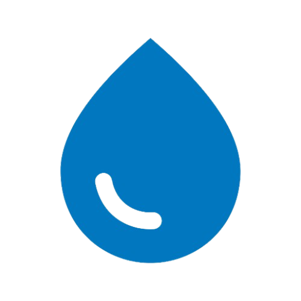
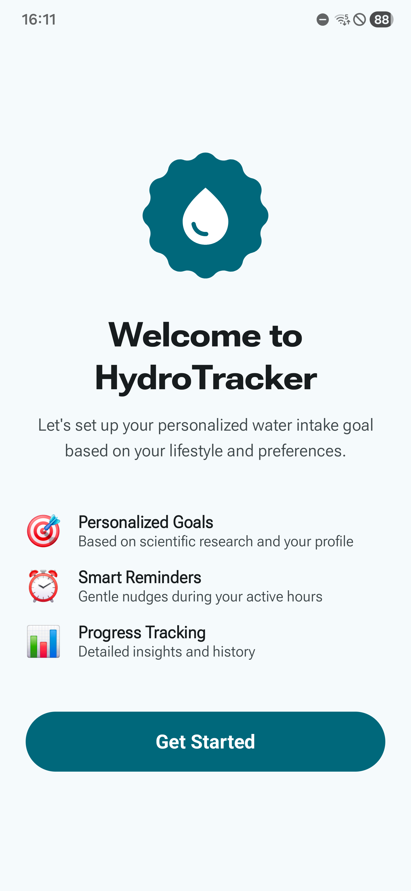
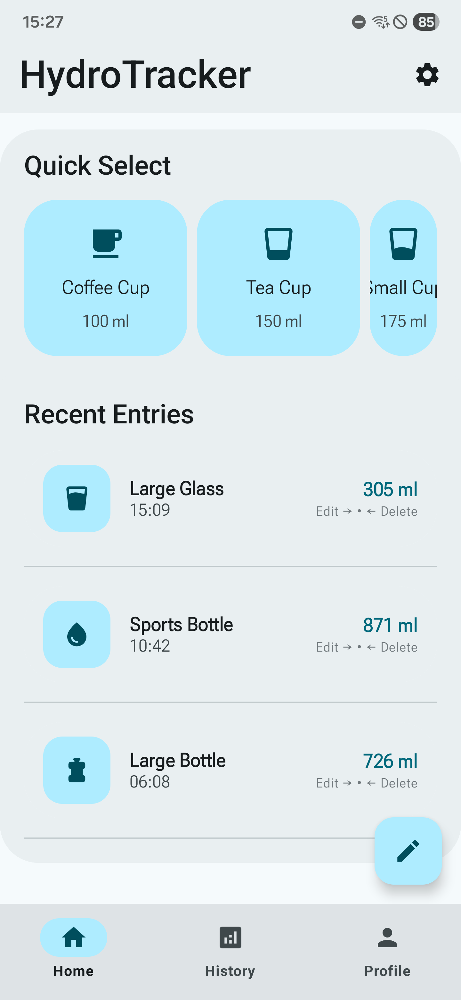
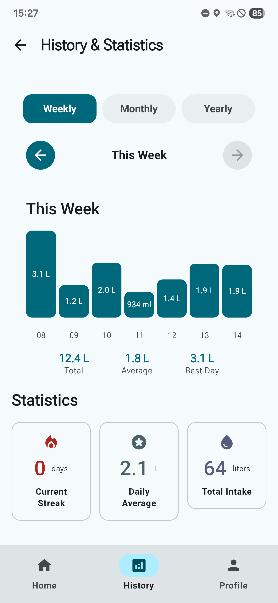
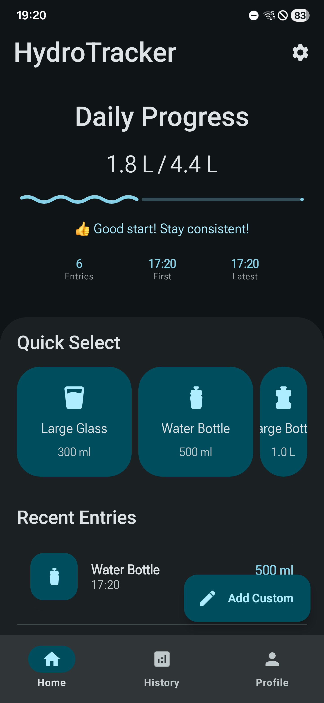
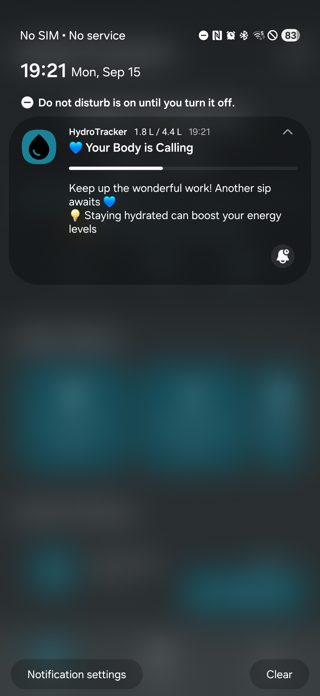

# HydroTracker

<p align="center">
  
</p>

<p align="center">
  <strong>A modern, intelligent water intake tracking application</strong><br>
  No Ads, No Subscription, No Nonsense
</p>

<p align="center">
  <a href="#-features">Features</a> •
  <a href="#-screenshots">Screenshots</a> •
  <a href="#-installation">Installation</a> •
  <a href="#-contributing">Contributing</a> •
  <a href="#-license">License</a>
</p>

<p align="center">
  
  
  
  
</p>

---

## ✨ Features

### 🎯 Core Functionality
- **Daily Water Tracking** - Log intake with pre-defined containers or custom amounts
- **Smart Goal Setting** - Personalized daily hydration goals based on user profile
- **Comprehensive Analytics** - Daily and historical statistics with trend analysis

### 🎨 User Experience
- **Material 3 Expressive Design** - Latest Material Design with Expressive APIs and dynamic theming
- **Guided Onboarding** - Multi-step personalized setup flow
- **Quick Actions** - Container presets for instant logging
- **Rich History** - Detailed intake history with patterns and insights

### 🤖 Smart Features
- **Intelligent Notifications** - Context-aware reminders that respect sleep schedules
- **Home Screen Widgets** - Multiple widget sizes with real-time progress updates (Work in Progress)
- **Activity-Based Goals** - Recommendations based on activity level and personal metrics
- **Robust Data Persistence** - Fully local SQLite database with automatic backups

### 👤 Customization
- **Theme Customization** - Dynamic colors, dark mode, and accessibility features
- **Flexible Scheduling** - Customizable reminder intervals and active hours
- **Profile Management** - Comprehensive user settings and preferences

---

## 📱 Screenshots

<p align="center">
  
  
  
  
</p>

### Themes & Notifications
| Light Mode | Dark Mode | Notification |
|-----------|----------------|--------------|
|  |  |  |

---

## 📦 Installation

### Direct APK
Download the latest APK from [Releases](https://github.com/cemcakmak/HydroTracker/releases)

### Alernative: Build It Yourself

#### Prerequisites
- **Android Studio** - Koala Feature Drop | 2024.1.2 or later
- **Android SDK** - API 34+ (Target SDK 36)
- **Kotlin** - 2.0.21+
- **Gradle** - 8.12.0+

#### Build Steps

1. **Clone the repository**
   ```bash
   git clone https://github.com/cemcakmak/HydroTracker.git
   cd HydroTracker
   ```

2. **Open in Android Studio**
   - Launch Android Studio
   - Select "Open an Existing Project"
   - Navigate to the cloned directory

3. **Build the project**
   ```bash
   ./gradlew assembleDebug
   ```

4. **Install on device**
   ```bash
   ./gradlew installDebug
   ```

---

## 🔒 Privacy & Security

### Data Protection
- **Local Storage** - All data stored locally using Room database
- **No Cloud Sync** - Data remains on your device
- **No Analytics** - No usage tracking or personal data collection
- **Offline First** - Full functionality without internet

### Permissions Usage
- **Notifications** - Only for hydration reminders
- **Exact Alarms** - Precise notification timing
- **Camera** - Optional profile photo (stored locally)

---

## 📄 License

This project is licensed under the **GNU General Public License v3.0** - see the [LICENSE.md](app/src/main/assets/LICENSE.md) file for details.

### What this means:
- ✅ **Use** - Use this code for any purpose
- ✅ **Study** - Examine how it works
- ✅ **Share** - Distribute the app
- ✅ **Modify** - Make changes and improvements
- 📋 **Copyleft** - Derivative works must also be GPL v3.0

---

## 🆘 Support

### Get Help
- **🐛 Bug Reports** - [GitHub Issues](https://github.com/cemcakmak/HydroTracker/issues)
- **💡 Feature Requests** - [GitHub Discussions](https://github.com/cemcakmak/HydroTracker/discussions)

---

<p align="center">
  <strong>HydroTracker - Stay hydrated, stay healthy!💧</strong><br>
  <em>Developed by Ali Cem Çakmak</em>
</p>