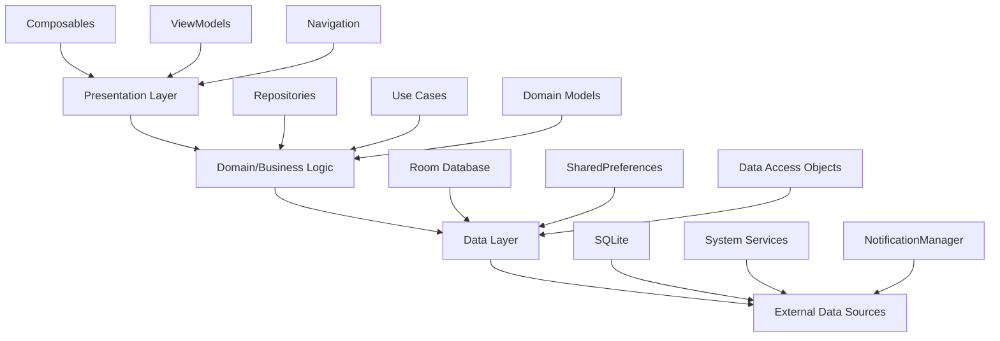
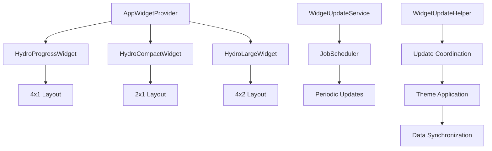
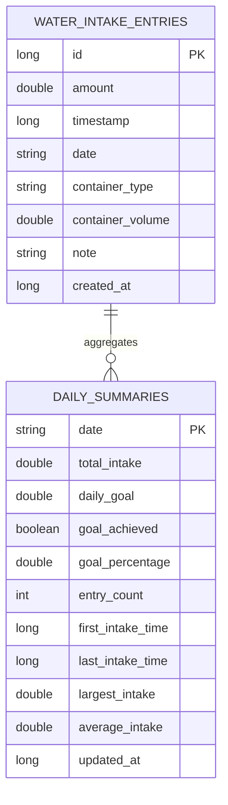

# 🏗️ HydroTracker Technical Documentation

## Table of Contents
1. [Architecture Overview](#architecture-overview)
2. [Data Layer Architecture](#data-layer-architecture)
3. [Presentation Layer](#presentation-layer)
4. [Notification System](#notification-system)
5. [Widget Framework](#widget-framework)
6. [Database Schema](#database-schema)
7. [State Management](#state-management)
8. [Performance Optimizations](#performance-optimizations)
9. [Security Considerations](#security-considerations)
10. [Testing Strategy](#testing-strategy)
11. [Build Configuration](#build-configuration)
12. [Deployment Pipeline](#deployment-pipeline)

---

## Architecture Overview

### 🎯 Architectural Paradigm
HydroTracker implements a **Clean Architecture** approach with **MVVM (Model-View-ViewModel)** pattern, ensuring separation of concerns, testability, and maintainability. The architecture leverages modern Android development practices including **Single Activity Architecture** with **Navigation Compose**.



### 🏛️ Layered Architecture

#### **Presentation Layer**
- **UI Components**: Jetpack Compose with Material 3 Expressive APIs
- **State Management**: StateFlow, Compose State, and reactive programming
- **Navigation**: Navigation Compose with type-safe routing
- **Theme System**: Dynamic theming with Material You integration

#### **Business Logic Layer**
- **Repositories**: Abstraction over data sources with business logic
- **Data Models**: Domain entities representing business concepts
- **Utility Functions**: Water calculation algorithms and formatting logic

#### **Data Persistence Layer**
- **Room Database**: SQLite abstraction with reactive queries
- **SharedPreferences**: User preferences and application settings
- **Data Access Objects (DAOs)**: Type-safe database operations

---

## Data Layer Architecture

### 🗃️ Repository Pattern Implementation

The data layer implements the **Repository Pattern** with reactive programming using **Kotlin Flows** for real-time data updates and efficient state propagation.

#### **WaterIntakeRepository**
```kotlin
class WaterIntakeRepository(
    private val waterIntakeDao: WaterIntakeDao,
    private val dailySummaryDao: DailySummaryDao,
    private val userRepository: UserRepository
) {
    // Reactive data streams with Flow
    fun getTodayProgress(): Flow<WaterProgress>
    fun getTodayEntries(): Flow<List<WaterIntakeEntry>>
    fun getTodayStatistics(): Flow<TodayStatistics>
    
    // CRUD operations with Result wrapper
    suspend fun addWaterIntake(amount: Double, containerPreset: ContainerPreset): Result<WaterIntakeEntry>
    suspend fun deleteWaterIntake(entry: WaterIntakeEntry): Result<Unit>
    
    // Analytics and aggregations
    suspend fun getWeeklyStatistics(): Result<WeeklyStatistics>
    suspend fun getMonthlyTrends(): Result<List<DailySummary>>
}
```

#### **UserRepository**
```kotlin
class UserRepository(context: Context) {
    private val sharedPreferences: SharedPreferences
    
    // Reactive user profile stream
    val userProfile: StateFlow<UserProfile?>
    val isOnboardingCompleted: StateFlow<Boolean>
    val themePreferences: StateFlow<ThemePreferences>
    
    // Profile management
    suspend fun updateUserProfile(profile: UserProfile): Result<Unit>
    suspend fun completeOnboarding(): Result<Unit>
    
    // Theme and preferences
    suspend fun updateThemePreferences(preferences: ThemePreferences): Result<Unit>
}
```

### 📊 Data Flow Architecture



```mermaid
graph LR
    A[User Interaction] --> B[Compose UI]
    B --> C[ViewModel]
    C --> D[Repository]
    D --> E[Room DAO]
    E --> F[SQLite Database]
    
    F --> G[Flow Emission]
    G --> H[Repository Processing]
    H --> I[ViewModel State]
    I --> J[Compose Recomposition]
    J --> K[UI Update]
```

### 🔄 Reactive Data Streams

The application utilizes **Kotlin Flows** for reactive data streams, enabling real-time UI updates when underlying data changes:

```kotlin
// Real-time progress tracking
val todayProgress by waterIntakeRepository.getTodayProgress()
    .collectAsState(initial = WaterProgress.empty())

// Automatic UI recomposition on data changes
LaunchedEffect(todayProgress) {
    if (todayProgress.isGoalAchieved) {
        celebrationAnimation.start()
    }
}
```

---

## Presentation Layer

### 🎨 Jetpack Compose Architecture

The presentation layer is built entirely with **Jetpack Compose**, utilizing the latest **Material 3 Expressive APIs** for cutting-edge user interface components and animations.

#### **Compose State Management**

```kotlin
@Composable
fun HomeScreen(
    userProfile: UserProfile,
    waterIntakeRepository: WaterIntakeRepository
) {
    // State hoisting with remember
    var isVisible by remember { mutableStateOf(false) }
    val snackbarHostState = remember { SnackbarHostState() }
    
    // Reactive data collection
    val todayProgress by waterIntakeRepository.getTodayProgress()
        .collectAsState(initial = WaterProgress.empty())
    
    // Animation state management
    val animatedProgress by animateFloatAsState(
        targetValue = todayProgress.progress,
        animationSpec = ProgressIndicatorDefaults.ProgressAnimationSpec
    )
    
    // Coroutine scope for suspend operations
    val coroutineScope = rememberCoroutineScope()
}
```

#### **Material 3 Expressive Components**

HydroTracker leverages advanced Material 3 components:

- **LinearWavyProgressIndicator**: Animated progress visualization with wave effects
- **HorizontalMultiBrowseCarousel**: Container preset selection with smooth scrolling
- **Dynamic Color System**: Automatic color extraction from wallpaper (Android 12+)
- **Expressive Typography**: Enhanced readability with updated type scales

### 🧭 Navigation Architecture

**Navigation Compose** provides type-safe navigation with smooth transitions:

```kotlin
sealed class NavigationRoutes {
    object HOME : NavigationRoutes()
    object HISTORY : NavigationRoutes()
    object PROFILE : NavigationRoutes()
    object SETTINGS : NavigationRoutes()
    object ONBOARDING : NavigationRoutes()
}

@Composable
fun HydroTrackerNavigation() {
    val navController = rememberNavController()
    
    NavHost(navController = navController, startDestination = NavigationRoutes.HOME) {
        composable(NavigationRoutes.HOME) {
            HomeScreen(/* parameters */)
        }
        // Additional destinations with shared element transitions
    }
}
```

### 🎭 Theme System Architecture

```kotlin
@Composable
fun HydroTrackerTheme(
    themePreferences: ThemePreferences,
    content: @Composable () -> Unit
) {
    val colorScheme = when {
        themePreferences.useDynamicColor && Build.VERSION.SDK_INT >= Build.VERSION_CODES.S -> {
            dynamicColorScheme(LocalContext.current, themePreferences.isDarkMode)
        }
        themePreferences.isDarkMode -> DarkColorScheme
        else -> LightColorScheme
    }
    
    MaterialTheme(
        colorScheme = colorScheme,
        typography = HydroTypography,
        shapes = HydroShapes,
        content = content
    )
}
```

---

## Notification System

### 📢 Intelligent Notification Scheduling

The notification system implements **AlarmManager** with precise timing calculations, respecting user sleep schedules and goal achievement status.

#### **HydroNotificationScheduler Architecture**

```kotlin
object HydroNotificationScheduler {
    // Precise alarm scheduling with sleep hour awareness
    fun scheduleNextReminder(context: Context, userProfile: UserProfile) {
        CoroutineScope(Dispatchers.IO).launch {
            val currentProgress = waterIntakeRepository.getTodayProgress().first()
            
            // Skip scheduling if goal achieved
            if (currentProgress.isGoalAchieved) return@launch
            
            val nextReminderTime = calculateNextReminderTime(userProfile)
            
            if (nextReminderTime != null && isWithinWakingHours(nextReminderTime, userProfile)) {
                scheduleNotification(context, nextReminderTime)
            }
        }
    }
    
    // Advanced time calculation algorithms
    private fun calculateNextReminderTime(userProfile: UserProfile): Calendar? {
        val now = Calendar.getInstance()
        val currentTime = LocalTime.now()
        
        val wakeUpTime = parseTime(userProfile.wakeUpTime)
        val sleepTime = parseTime(userProfile.sleepTime)
        
        // Complex logic for cross-day sleep schedules
        return when {
            isInSleepHours(currentTime, wakeUpTime, sleepTime) -> {
                calculateNextDayWakeUpReminder(wakeUpTime, userProfile.reminderInterval)
            }
            else -> calculateImmediateNextReminder(now, userProfile.reminderInterval)
        }
    }
}
```

#### **Notification Content Provider**

```kotlin
class NotificationContentProvider(private val context: Context) {
    fun generateReminderContent(userProfile: UserProfile, progress: WaterProgress): NotificationContent {
        val message = when {
            progress.progress < 0.25f -> generateEarlyMotivation(userProfile)
            progress.progress < 0.75f -> generateMidDayEncouragement(userProfile)
            else -> generateFinalPushMessage(userProfile)
        }
        
        return NotificationContent(
            title = "💧 Hydration Reminder",
            text = message,
            actions = generateQuickActions(userProfile.containerPresets)
        )
    }
}
```

### 🔔 Permission Management

```kotlin
object NotificationPermissionManager {
    fun requestNotificationPermission(activity: ComponentActivity) {
        if (Build.VERSION.SDK_INT >= Build.VERSION_CODES.TIRAMISU) {
            ActivityCompat.requestPermissions(
                activity,
                arrayOf(Manifest.permission.POST_NOTIFICATIONS),
                NOTIFICATION_PERMISSION_REQUEST_CODE
            )
        }
    }
    
    fun hasNotificationPermission(context: Context): Boolean {
        return if (Build.VERSION.SDK_INT >= Build.VERSION_CODES.TIRAMISU) {
            ContextCompat.checkSelfPermission(
                context,
                Manifest.permission.POST_NOTIFICATIONS
            ) == PackageManager.PERMISSION_GRANTED
        } else true
    }
}
```

---

## Widget Framework

### 📱 Multi-Size Widget Architecture

HydroTracker implements a comprehensive widget system supporting multiple form factors with adaptive theming and real-time data synchronization.

#### **Widget Architecture Hierarchy**



#### **HydroProgressWidget Implementation**

```kotlin
class HydroProgressWidget : AppWidgetProvider() {
    private val widgetScope = CoroutineScope(Dispatchers.IO + SupervisorJob())
    
    override fun onUpdate(context: Context, appWidgetManager: AppWidgetManager, appWidgetIds: IntArray) {
        appWidgetIds.forEach { appWidgetId ->
            updateWidget(context, appWidgetManager, appWidgetId)
        }
    }
    
    private fun updateWidget(context: Context, appWidgetManager: AppWidgetManager, appWidgetId: Int) {
        widgetScope.launch {
            try {
                val userRepository = UserRepository(context)
                val waterRepository = DatabaseInitializer.getWaterIntakeRepository(context, userRepository)
                
                // Reactive data retrieval
                val progress = waterRepository.getTodayProgress().first()
                val userProfile = userRepository.userProfile.first()
                
                // Dynamic layout creation
                val views = createWidgetLayout(context, progress, userProfile)
                
                // Theme-aware styling
                applyDynamicTheming(context, views, userRepository)
                
                // Widget update with error handling
                appWidgetManager.updateAppWidget(appWidgetId, views)
                
            } catch (e: Exception) {
                // Graceful degradation with default values
                updateWidgetWithDefaults(context, appWidgetManager, appWidgetId)
            }
        }
    }
}
```

#### **Dynamic Theming for Widgets**

```kotlin
private fun applyDynamicTheming(context: Context, views: RemoteViews, userRepository: UserRepository) {
    val isDarkMode = isSystemInDarkMode(context)
    
    val colors = if (Build.VERSION.SDK_INT >= Build.VERSION_CODES.S) {
        // Material You dynamic colors
        DynamicColorExtractor.extractColors(context, isDarkMode)
    } else {
        // Fallback color scheme
        FallbackColorScheme.getColors(isDarkMode)
    }
    
    views.apply {
        setTextColor(R.id.widget_progress_text, colors.onSurface)
        setTextColor(R.id.widget_progress_percent, colors.primary)
        setTextColor(R.id.widget_last_updated, colors.onSurfaceVariant)
        setProgressBarColor(R.id.widget_progress_bar, colors.primary, colors.surfaceVariant)
    }
}
```

### ⏰ Widget Update Service

```kotlin
class WidgetUpdateService : JobIntentService() {
    companion object {
        private const val JOB_ID = 2000
        
        fun scheduleUpdates(context: Context) {
            if (Build.VERSION.SDK_INT >= Build.VERSION_CODES.LOLLIPOP) {
                val jobScheduler = context.getSystemService(Context.JOB_SCHEDULER_SERVICE) as JobScheduler
                
                val jobInfo = JobInfo.Builder(JOB_ID, ComponentName(context, WidgetUpdateService::class.java))
                    .setPersisted(true)
                    .setPeriodic(TimeUnit.MINUTES.toMillis(15)) // Update every 15 minutes
                    .setRequiredNetworkType(JobInfo.NETWORK_TYPE_NONE)
                    .build()
                
                jobScheduler.schedule(jobInfo)
            }
        }
    }
    
    override fun onHandleWork(intent: Intent) {
        WidgetUpdateHelper.updateAllWidgets(this)
    }
}
```

---

## Database Schema

### 🗄️ Room Database Architecture

HydroTracker utilizes **Room** as the database abstraction layer, providing type-safe database operations with reactive query capabilities.

#### **Entity Relationship Diagram**



#### **Database Configuration**

```kotlin
@Database(
    entities = [
        WaterIntakeEntry::class,
        DailySummary::class
    ],
    version = 1,
    exportSchema = true
)
@TypeConverters(DateConverters::class)
abstract class HydroTrackerDatabase : RoomDatabase() {
    abstract fun waterIntakeDao(): WaterIntakeDao
    abstract fun dailySummaryDao(): DailySummaryDao
    
    companion object {
        const val DATABASE_NAME = "hydrotracker_database"
    }
}
```

#### **Data Access Objects (DAOs)**

```kotlin
@Dao
interface WaterIntakeDao {
    // Reactive queries with Flow
    @Query("SELECT * FROM water_intake_entries WHERE date = :date ORDER BY timestamp DESC")
    fun getEntriesForDate(date: String): Flow<List<WaterIntakeEntry>>
    
    @Query("""
        SELECT 
            COALESCE(SUM(amount), 0) as totalIntake,
            COUNT(*) as entryCount,
            COALESCE(AVG(amount), 0) as averageIntake,
            COALESCE(MAX(amount), 0) as largestIntake,
            MIN(timestamp) as firstIntakeTime,
            MAX(timestamp) as lastIntakeTime
        FROM water_intake_entries 
        WHERE date = :date
    """)
    fun getTodayStatistics(date: String): Flow<TodayStatisticsResult>
    
    // Efficient batch operations
    @Insert(onConflict = OnConflictStrategy.REPLACE)
    suspend fun insertWaterIntake(entry: WaterIntakeEntry): Long
    
    @Delete
    suspend fun deleteWaterIntake(entry: WaterIntakeEntry)
    
    // Complex analytical queries
    @Query("""
        SELECT date, SUM(amount) as daily_total 
        FROM water_intake_entries 
        WHERE date BETWEEN :startDate AND :endDate 
        GROUP BY date 
        ORDER BY date DESC
    """)
    suspend fun getWeeklyTotals(startDate: String, endDate: String): List<DailyTotal>
}
```

#### **Database Initialization**

```kotlin
object DatabaseInitializer {
    @Volatile
    private var INSTANCE: HydroTrackerDatabase? = null
    
    fun getDatabase(context: Context): HydroTrackerDatabase {
        return INSTANCE ?: synchronized(this) {
            val instance = Room.databaseBuilder(
                context.applicationContext,
                HydroTrackerDatabase::class.java,
                HydroTrackerDatabase.DATABASE_NAME
            )
            .addCallback(DatabaseCallback())
            .fallbackToDestructiveMigration()
            .build()
            
            INSTANCE = instance
            instance
        }
    }
    
    fun getWaterIntakeRepository(context: Context, userRepository: UserRepository): WaterIntakeRepository {
        val database = getDatabase(context)
        return WaterIntakeRepository(
            waterIntakeDao = database.waterIntakeDao(),
            dailySummaryDao = database.dailySummaryDao(),
            userRepository = userRepository
        )
    }
}
```

---

## State Management

### 🔄 Reactive State Architecture

HydroTracker implements a comprehensive state management strategy using **StateFlow**, **Compose State**, and **Flow-based reactive programming**.

#### **ViewModel State Management**

```kotlin
class ThemeViewModel(private val userRepository: UserRepository) : ViewModel() {
    private val _themePreferences = MutableStateFlow(ThemePreferences.default())
    val themePreferences: StateFlow<ThemePreferences> = _themePreferences.asStateFlow()
    
    init {
        // Initialize with saved preferences
        viewModelScope.launch {
            userRepository.themePreferences.collect { preferences ->
                _themePreferences.value = preferences
            }
        }
    }
    
    fun updateDarkModePreference(isDarkMode: Boolean) {
        viewModelScope.launch {
            val updated = _themePreferences.value.copy(isDarkMode = isDarkMode)
            userRepository.updateThemePreferences(updated)
        }
    }
    
    fun toggleDynamicColor() {
        viewModelScope.launch {
            val updated = _themePreferences.value.copy(
                useDynamicColor = !_themePreferences.value.useDynamicColor
            )
            userRepository.updateThemePreferences(updated)
        }
    }
}
```

#### **Compose State Integration**

```kotlin
@Composable
fun HomeScreen(waterIntakeRepository: WaterIntakeRepository) {
    // Reactive data collection with initial values
    val todayProgress by waterIntakeRepository.getTodayProgress()
        .collectAsState(initial = WaterProgress.empty())
    
    val todayEntries by waterIntakeRepository.getTodayEntries()
        .collectAsState(initial = emptyList())
    
    // Local UI state management
    var showCustomDialog by remember { mutableStateOf(false) }
    var isVisible by remember { mutableStateOf(false) }
    
    // Animation state derived from data
    val animatedProgress by animateFloatAsState(
        targetValue = todayProgress.progress,
        animationSpec = ProgressIndicatorDefaults.ProgressAnimationSpec,
        label = "progress_animation"
    )
    
    // Side effects for state changes
    LaunchedEffect(todayProgress.isGoalAchieved) {
        if (todayProgress.isGoalAchieved) {
            // Trigger celebration animation or notification
            celebrateGoalAchievement()
        }
    }
}
```

### 📊 Data Transformation Pipeline

```kotlin
class WaterIntakeRepository {
    fun getTodayProgress(): Flow<WaterProgress> {
        return combine(
            waterIntakeDao.getTodayStatistics(getCurrentDate()),
            userRepository.userProfile
        ) { statistics, profile ->
            WaterProgress(
                currentIntake = statistics.totalIntake,
                dailyGoal = profile?.dailyWaterGoal ?: 2700.0,
                progress = (statistics.totalIntake / (profile?.dailyWaterGoal ?: 2700.0)).toFloat().coerceAtMost(1f),
                isGoalAchieved = statistics.totalIntake >= (profile?.dailyWaterGoal ?: 2700.0),
                remainingAmount = maxOf(0.0, (profile?.dailyWaterGoal ?: 2700.0) - statistics.totalIntake)
            )
        }
    }
}
```

---

## Performance Optimizations

### ⚡ Database Performance

#### **Indexing Strategy**
```sql
-- Optimized indices for frequent queries
CREATE INDEX IF NOT EXISTS index_water_intake_entries_timestamp ON water_intake_entries(timestamp);
CREATE INDEX IF NOT EXISTS index_water_intake_entries_date ON water_intake_entries(date);
CREATE UNIQUE INDEX IF NOT EXISTS index_daily_summaries_date ON daily_summaries(date);
```

#### **Query Optimization**
```kotlin
// Efficient pagination for history screen
@Query("""
    SELECT * FROM water_intake_entries 
    WHERE date BETWEEN :startDate AND :endDate 
    ORDER BY timestamp DESC 
    LIMIT :limit OFFSET :offset
""")
suspend fun getEntriesPaginated(startDate: String, endDate: String, limit: Int, offset: Int): List<WaterIntakeEntry>

// Aggregated statistics with single query
@Query("""
    SELECT 
        date,
        SUM(amount) as total_intake,
        COUNT(*) as entry_count,
        AVG(amount) as average_intake,
        MAX(amount) as largest_intake
    FROM water_intake_entries 
    WHERE date BETWEEN :startDate AND :endDate 
    GROUP BY date 
    ORDER BY date DESC
""")
suspend fun getWeeklyAggregates(startDate: String, endDate: String): List<WeeklyStatistics>
```

### 🎨 UI Performance

#### **Compose Optimization**
```kotlin
@Composable
fun OptimizedWaterEntryList(entries: List<WaterIntakeEntry>) {
    // LazyColumn for efficient scrolling
    LazyColumn(
        verticalArrangement = Arrangement.spacedBy(8.dp),
        contentPadding = PaddingValues(16.dp)
    ) {
        items(
            items = entries,
            key = { entry -> entry.id } // Stable keys for recomposition optimization
        ) { entry ->
            // Memoized item composition
            WaterEntryItem(
                entry = entry,
                modifier = Modifier.animateItemPlacement() // Smooth list animations
            )
        }
    }
}

@Composable
private fun WaterEntryItem(entry: WaterIntakeEntry, modifier: Modifier = Modifier) {
    // Remember expensive calculations
    val formattedAmount = remember(entry.amount) { 
        WaterCalculator.formatWaterAmount(entry.amount) 
    }
    val formattedTime = remember(entry.timestamp) { 
        entry.getFormattedTime() 
    }
    
    Card(modifier = modifier) {
        // UI implementation
    }
}
```

#### **Memory Management**
```kotlin
class WaterIntakeRepository {
    // Connection pooling for database operations
    private val databaseScope = CoroutineScope(
        Dispatchers.IO + SupervisorJob() + 
        CoroutineExceptionHandler { _, exception ->
            Log.e("Repository", "Database operation failed", exception)
        }
    )
    
    // Cached computations for expensive operations
    private val dailyStatisticsCache = LruCache<String, TodayStatistics>(7) // Cache last 7 days
    
    suspend fun getTodayStatistics(): Flow<TodayStatistics> {
        val today = getCurrentDate()
        return flow {
            // Check cache first
            dailyStatisticsCache.get(today)?.let { cached ->
                emit(cached)
            }
            
            // Fetch from database
            waterIntakeDao.getTodayStatistics(today).collect { statistics ->
                dailyStatisticsCache.put(today, statistics)
                emit(statistics)
            }
        }.flowOn(Dispatchers.IO)
    }
}
```

---

## Security Considerations

### 🔒 Data Security

#### **Local Data Protection**
```kotlin
// Encrypted SharedPreferences for sensitive data
class SecureUserRepository(context: Context) {
    private val encryptedPreferences = EncryptedSharedPreferences.create(
        "secure_hydro_prefs",
        MasterKey.Builder(context).setKeyScheme(MasterKey.KeyScheme.AES256_GCM).build(),
        context,
        EncryptedSharedPreferences.PrefKeyEncryptionScheme.AES256_SIV,
        EncryptedSharedPreferences.PrefValueEncryptionScheme.AES256_GCM
    )
    
    fun saveSecureUserData(userData: UserProfile) {
        encryptedPreferences.edit()
            .putString("user_profile", userData.toEncryptedJson())
            .apply()
    }
}
```

#### **Permission Management**
```kotlin
// Runtime permission handling with rationale
class PermissionManager(private val activity: ComponentActivity) {
    fun requestNotificationPermissionWithRationale() {
        when {
            ContextCompat.checkSelfPermission(activity, Manifest.permission.POST_NOTIFICATIONS) == 
                PackageManager.PERMISSION_GRANTED -> {
                // Permission already granted
                onPermissionGranted()
            }
            
            ActivityCompat.shouldShowRequestPermissionRationale(activity, Manifest.permission.POST_NOTIFICATIONS) -> {
                // Show rationale dialog
                showPermissionRationale {
                    requestPermissionLauncher.launch(Manifest.permission.POST_NOTIFICATIONS)
                }
            }
            
            else -> {
                // Request permission directly
                requestPermissionLauncher.launch(Manifest.permission.POST_NOTIFICATIONS)
            }
        }
    }
}
```

### 🛡️ Input Validation

```kotlin
class WaterIntakeValidator {
    companion object {
        private const val MIN_INTAKE_ML = 1.0
        private const val MAX_INTAKE_ML = 5000.0
        private const val MAX_DAILY_GOAL_ML = 10000.0
        
        fun validateWaterIntake(amount: Double): ValidationResult {
            return when {
                amount < MIN_INTAKE_ML -> ValidationResult.Error("Amount must be at least ${MIN_INTAKE_ML}ml")
                amount > MAX_INTAKE_ML -> ValidationResult.Error("Amount cannot exceed ${MAX_INTAKE_ML}ml")
                amount.isNaN() || amount.isInfinite() -> ValidationResult.Error("Invalid amount")
                else -> ValidationResult.Success
            }
        }
        
        fun sanitizeUserInput(input: String): String {
            return input.trim()
                .replace(Regex("[^\\d.]"), "") // Remove non-numeric characters
                .take(8) // Limit length
        }
    }
}
```

---

## Testing Strategy

### 🧪 Testing Architecture

#### **Unit Testing Framework**
```kotlin
class WaterIntakeRepositoryTest {
    @Mock
    private lateinit var waterIntakeDao: WaterIntakeDao
    
    @Mock
    private lateinit var userRepository: UserRepository
    
    private lateinit var repository: WaterIntakeRepository
    
    @Before
    fun setup() {
        MockitoAnnotations.openMocks(this)
        repository = WaterIntakeRepository(waterIntakeDao, mockk(), userRepository)
    }
    
    @Test
    fun `addWaterIntake should insert entry and return success`() = runTest {
        // Given
        val amount = 250.0
        val containerPreset = ContainerPreset.GLASS
        val expectedEntry = WaterIntakeEntry.create(amount, containerPreset.name, containerPreset.volume)
        
        whenever(waterIntakeDao.insertWaterIntake(any())).thenReturn(1L)
        
        // When
        val result = repository.addWaterIntake(amount, containerPreset)
        
        // Then
        assertTrue(result.isSuccess)
        verify(waterIntakeDao).insertWaterIntake(argThat { 
            amount == this.amount && containerType == containerPreset.name 
        })
    }
    
    @Test
    fun `getTodayProgress should return correct progress calculation`() = runTest {
        // Given
        val dailyGoal = 2700.0
        val currentIntake = 1350.0
        val userProfile = UserProfile(dailyWaterGoal = dailyGoal)
        val statistics = TodayStatistics(totalIntake = currentIntake)
        
        whenever(userRepository.userProfile).thenReturn(flowOf(userProfile))
        whenever(waterIntakeDao.getTodayStatistics(any())).thenReturn(flowOf(statistics))
        
        // When
        val progress = repository.getTodayProgress().first()
        
        // Then
        assertEquals(0.5f, progress.progress, 0.01f)
        assertEquals(currentIntake, progress.currentIntake)
        assertEquals(dailyGoal, progress.dailyGoal)
        assertFalse(progress.isGoalAchieved)
    }
}
```

#### **Compose UI Testing**
```kotlin
@RunWith(AndroidJUnit4::class)
class HomeScreenTest {
    @get:Rule
    val composeTestRule = createComposeRule()
    
    @Test
    fun homeScreen_displaysCorrectProgress() {
        // Given
        val userProfile = UserProfile(name = "Test User", dailyWaterGoal = 2700.0)
        val mockRepository = mockk<WaterIntakeRepository>()
        
        every { mockRepository.getTodayProgress() } returns flowOf(
            WaterProgress(currentIntake = 1000.0, dailyGoal = 2700.0, progress = 0.37f)
        )
        
        // When
        composeTestRule.setContent {
            HydroTrackerTheme {
                HomeScreen(
                    userProfile = userProfile,
                    waterIntakeRepository = mockRepository
                )
            }
        }
        
        // Then
        composeTestRule.onNodeWithText("1000ml / 2700ml").assertIsDisplayed()
        composeTestRule.onNodeWithText("37%").assertIsDisplayed()
    }
    
    @Test
    fun customWaterDialog_validatesInput() {
        composeTestRule.setContent {
            CustomWaterDialog(
                onDismiss = {},
                onConfirm = {}
            )
        }
        
        // Test invalid input
        composeTestRule.onNodeWithText("Amount (ml)").performTextInput("invalid")
        composeTestRule.onNodeWithText("Add").performClick()
        composeTestRule.onNodeWithText("Please enter a valid amount").assertIsDisplayed()
        
        // Test valid input
        composeTestRule.onNodeWithText("Amount (ml)").performTextClearance()
        composeTestRule.onNodeWithText("Amount (ml)").performTextInput("250")
        composeTestRule.onNodeWithText("Add").performClick()
        // Assert dialog dismissed
    }
}
```

### 📱 Integration Testing

```kotlin
@RunWith(AndroidJUnit4::class)
@LargeTest
class HydroTrackerIntegrationTest {
    @get:Rule
    val activityRule = ActivityScenarioRule(MainActivity::class.java)
    
    @Test
    fun completeWaterTrackingFlow() {
        // Start onboarding
        onView(withText("Get Started")).perform(click())
        
        // Complete profile setup
        onView(withId(R.id.name_input)).perform(typeText("Integration Test User"))
        onView(withText("Next")).perform(click())
        
        // Set daily goal
        onView(withId(R.id.goal_slider)).perform(setProgress(2500))
        onView(withText("Next")).perform(click())
        
        // Complete onboarding
        onView(withText("Start Tracking")).perform(click())
        
        // Add water intake
        onView(withText("Glass")).perform(click())
        
        // Verify progress update
        onView(withText("250ml / 2500ml")).check(matches(isDisplayed()))
        
        // Navigate to history
        onView(withId(R.id.navigation_history)).perform(click())
        
        // Verify entry appears in history
        onView(withText("Glass - 250ml")).check(matches(isDisplayed()))
    }
}
```

---

## Build Configuration

### 🔧 Gradle Build System

#### **Module-Level Build Configuration**
```kotlin
// app/build.gradle.kts
plugins {
    alias(libs.plugins.android.application)
    alias(libs.plugins.kotlin.android)
    alias(libs.plugins.kotlin.compose)
    id("com.google.devtools.ksp") version "2.0.21-1.0.25"
}

android {
    namespace = "com.cemcakmak.hydrotracker"
    compileSdk = 36
    
    defaultConfig {
        applicationId = "com.cemcakmak.hydrotracker"
        minSdk = 34
        targetSdk = 36
        versionCode = 1
        versionName = "1.0"
        
        testInstrumentationRunner = "androidx.test.runner.AndroidJUnitRunner"
        
        // Room schema export configuration
        javaCompileOptions {
            annotationProcessorOptions {
                arguments["room.schemaLocation"] = "$projectDir/schemas"
            }
        }
    }
    
    buildTypes {
        release {
            isMinifyEnabled = true
            proguardFiles(
                getDefaultProguardFile("proguard-android-optimize.txt"),
                "proguard-rules.pro"
            )
            
            // Enable R8 full mode for aggressive optimization
            isUseProguard = false
        }
        
        debug {
            applicationIdSuffix = ".debug"
            versionNameSuffix = "-DEBUG"
            isDebuggable = true
        }
    }
    
    compileOptions {
        sourceCompatibility = JavaVersion.VERSION_11
        targetCompatibility = JavaVersion.VERSION_11
        
        // Enable Java 8+ language features
        isCoreLibraryDesugaringEnabled = true
    }
    
    kotlinOptions {
        jvmTarget = "11"
        freeCompilerArgs += listOf(
            "-opt-in=androidx.compose.material3.ExperimentalMaterial3ExpressiveApi",
            "-opt-in=androidx.compose.animation.ExperimentalAnimationApi"
        )
    }
    
    buildFeatures {
        compose = true
        buildConfig = true
    }
    
    composeOptions {
        kotlinCompilerExtensionVersion = libs.versions.compose.compiler.get()
    }
    
    packaging {
        resources {
            excludes += "/META-INF/{AL2.0,LGPL2.1}"
        }
    }
}

// Room KSP configuration
ksp {
    arg("room.schemaLocation", "$projectDir/schemas")
    arg("room.incremental", "true")
    arg("room.expandProjection", "true")
}
```

#### **Dependency Management**
```toml
# gradle/libs.versions.toml
[versions]
agp = "8.12.0"
kotlin = "2.0.21"
compose-bom = "2025.07.00"
compose-compiler = "2.0.21"
room = "2.7.2"
lifecycle = "2.9.2"
navigation = "2.9.3"

[libraries]
# Compose BOM
androidx-compose-bom = { group = "androidx.compose", name = "compose-bom", version.ref = "compose-bom" }

# Core Compose
androidx-compose-ui = { group = "androidx.compose.ui", name = "ui" }
androidx-compose-ui-tooling = { group = "androidx.compose.ui", name = "ui-tooling" }
androidx-compose-material3 = { group = "androidx.compose.material3", name = "material3", version = "1.4.0-alpha18" }

# Room
androidx-room-runtime = { group = "androidx.room", name = "room-runtime", version.ref = "room" }
androidx-room-ktx = { group = "androidx.room", name = "room-ktx", version.ref = "room" }
androidx-room-compiler = { group = "androidx.room", name = "room-compiler", version.ref = "room" }

# Navigation
androidx-navigation-compose = { group = "androidx.navigation", name = "navigation-compose", version.ref = "navigation" }

# Lifecycle
androidx-lifecycle-viewmodel-compose = { group = "androidx.lifecycle", name = "lifecycle-viewmodel-compose", version.ref = "lifecycle" }
```

### 🚀 Build Optimization

#### **ProGuard Configuration**
```proguard
# app/proguard-rules.pro

# Preserve Room entities and DAOs
-keep class com.cemcakmak.hydrotracker.data.database.entities.** { *; }
-keep class com.cemcakmak.hydrotracker.data.database.dao.** { *; }

# Preserve Compose runtime
-keep class androidx.compose.runtime.** { *; }
-keep class androidx.compose.ui.** { *; }

# Preserve notification classes
-keep class com.cemcakmak.hydrotracker.notifications.** { *; }

# Preserve widget classes
-keep class com.cemcakmak.hydrotracker.widgets.** { *; }

# Remove logging in release
-assumenosideeffects class android.util.Log {
    public static boolean isLoggable(java.lang.String, int);
    public static int v(...);
    public static int i(...);
    public static int w(...);
    public static int d(...);
    public static int e(...);
}
```

---

## Deployment Pipeline

### 🚚 CI/CD Configuration

#### **GitHub Actions Workflow**
```yaml
# .github/workflows/android.yml
name: Android CI/CD

on:
  push:
    branches: [ main, develop ]
  pull_request:
    branches: [ main ]

jobs:
  test:
    runs-on: ubuntu-latest
    
    steps:
    - uses: actions/checkout@v4
    
    - name: Set up JDK 17
      uses: actions/setup-java@v4
      with:
        java-version: '17'
        distribution: 'temurin'
    
    - name: Cache Gradle packages
      uses: actions/cache@v4
      with:
        path: |
          ~/.gradle/caches
          ~/.gradle/wrapper
        key: ${{ runner.os }}-gradle-${{ hashFiles('**/*.gradle*', '**/gradle-wrapper.properties') }}
        restore-keys: |
          ${{ runner.os }}-gradle-
    
    - name: Grant execute permission for gradlew
      run: chmod +x gradlew
    
    - name: Run unit tests
      run: ./gradlew test
    
    - name: Run lint
      run: ./gradlew lint
    
    - name: Upload test reports
      uses: actions/upload-artifact@v4
      if: always()
      with:
        name: test-reports
        path: app/build/reports/
  
  build:
    needs: test
    runs-on: ubuntu-latest
    
    steps:
    - uses: actions/checkout@v4
    
    - name: Set up JDK 17
      uses: actions/setup-java@v4
      with:
        java-version: '17'
        distribution: 'temurin'
    
    - name: Build debug APK
      run: ./gradlew assembleDebug
    
    - name: Upload APK
      uses: actions/upload-artifact@v4
      with:
        name: debug-apk
        path: app/build/outputs/apk/debug/*.apk
```

#### **Release Management**
```kotlin
// Automatic version code generation
android {
    defaultConfig {
        versionCode = calculateVersionCode()
        versionName = calculateVersionName()
    }
}

fun calculateVersionCode(): Int {
    val major = 1
    val minor = 0
    val patch = 0
    return major * 10000 + minor * 100 + patch
}

fun calculateVersionName(): String {
    val major = 1
    val minor = 0
    val patch = 0
    val buildNumber = System.getenv("BUILD_NUMBER") ?: "0"
    return "$major.$minor.$patch-$buildNumber"
}
```

---

This comprehensive technical documentation provides an in-depth analysis of HydroTracker's architecture, implementation details, and development practices. The application demonstrates modern Android development principles with cutting-edge technologies and robust engineering practices.